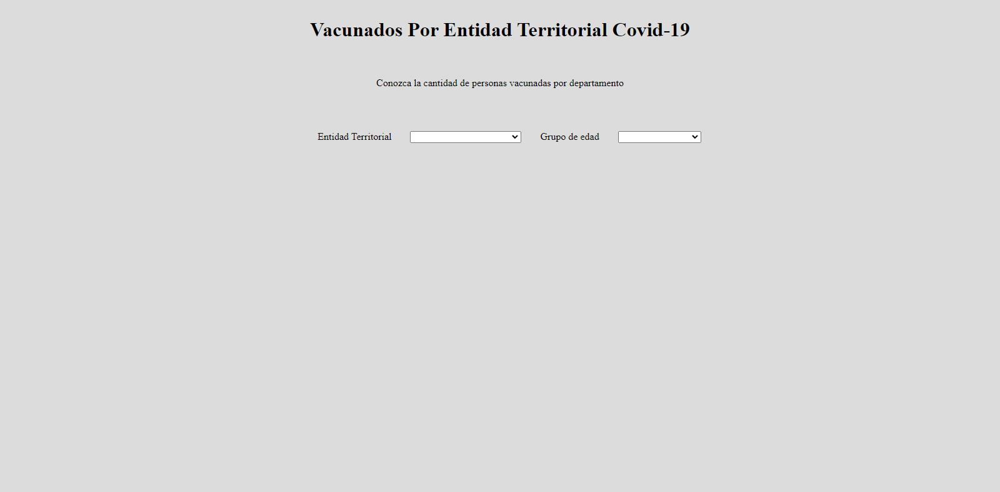
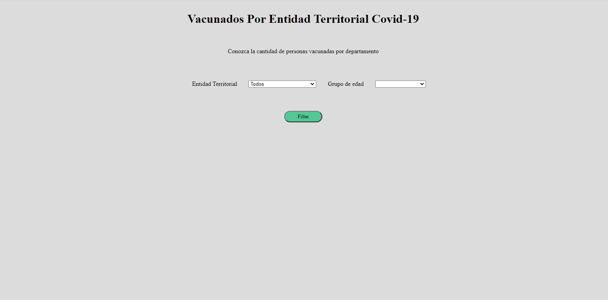
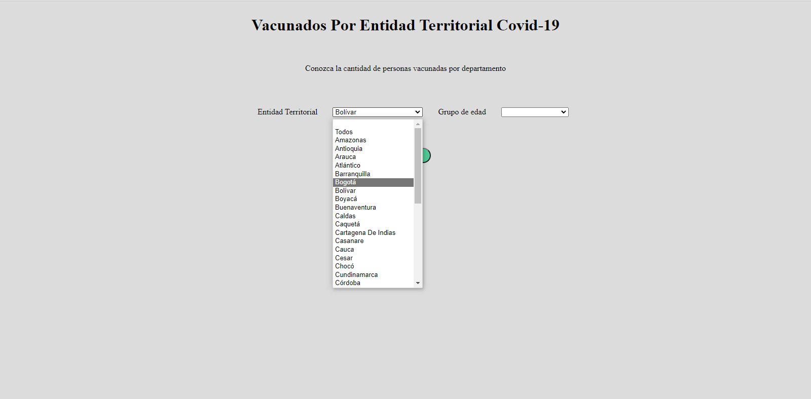
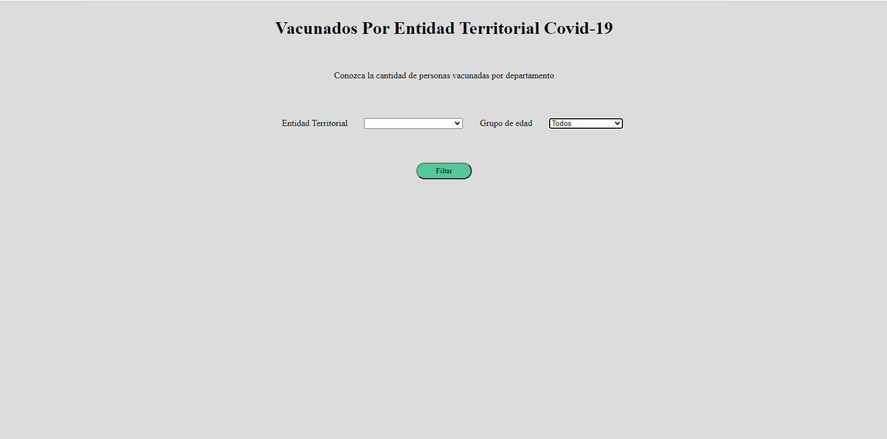
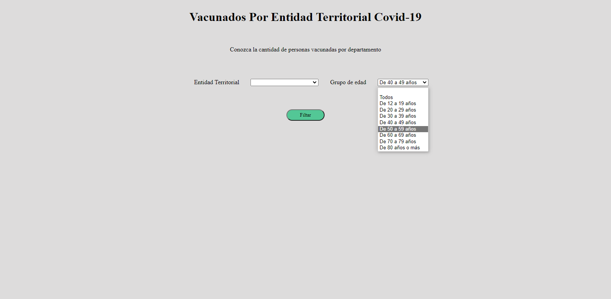
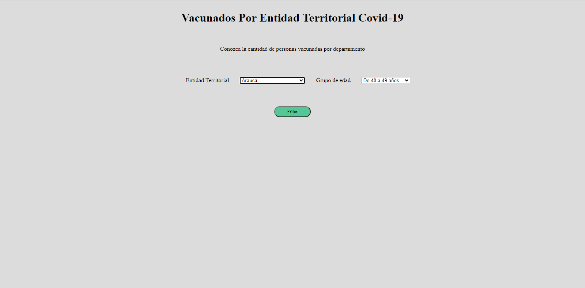

# Reto 1  Cinecias de Datos
## Integrantes :
* ###  Camilo Andrés Caimán Urquijo -20181020086
* ###  Johan Andrés Aguirre Diaz -20181020072

## Objetivo:

Desarrollar una aplicación web (recomendable usar Flask o Django) que:

* 1). Se conecte a Datos Abiertos de Colombia para acceder al conjunto de datos de Vacunación de Covid-19 y lo convierta en un dataframe de Pandas (Consultar sodapy y socrate).

* 2). Visualice el dataframe

* 3).Permita hacer consultas prediseñadas con parámetros definidos por el usuario y las visualice sin utilizar gráficas.

## Solucion

La pagina realizada consiste de 2 filtros como se ve en la siguiente  imagen :

Los filtros permiten:
    
*  Para el filtro de Entidad Territorial podemos filtrar ya sea por todos los departamentos o especificamente por uno en particular como se ven en las siguientes imagenes

   
    

    

* Para el filtro de Grupo de edad podemos filtrar ya sea por todos los intervalos o especificamente por uno en particular como se ven en las siguientes imagenes
    
     

     

## **Nota:**

Los filtros combinados no estan definidos, por lo cual no funcionan al  intentar generar el filtro como por ejemplo:

      